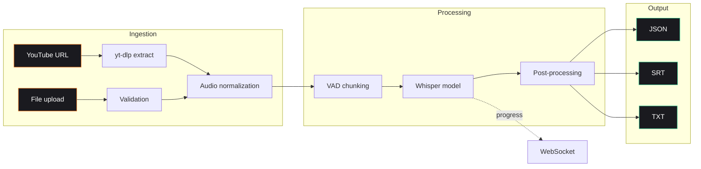

# Turkish Transcribe — Backend

> Production speech-to-text service for Turkish educational content. Whisper-powered, FastAPI-served, real-time.

[](https://www.python.org/)
[](https://fastapi.tiangolo.com/)
[](https://github.com/openai/whisper)
[](Dockerfile.backend)
[](LICENSE)

---

## What this does

A self-hosted Turkish speech-to-text service tuned for **educational content** — lectures, classroom recordings, YouTube tutorials. Built around OpenAI Whisper with audio-quality preprocessing, real-time WebSocket progress, and multi-format output (JSON / SRT / TXT).

Frontend lives at [turkish-transcribe-fe](https://github.com/1lker/turkish-transcribe-fe).

---

## Why it exists

General-purpose Turkish transcription tools choke on classroom audio: bad mics, code-switching with English technical terms, long monologues, slide-flip noise. This service ships the preprocessing + model selection that makes those usable.

---

## Features

| Capability | Detail |
|---|---|
| **Turkish-optimized** | Whisper model selection + decoding params tuned for Turkish-language audio |
| **YouTube ingest** | Direct URL → audio extract via `yt-dlp` |
| **Real-time progress** | WebSocket stream of chunk-level transcription state |
| **Multi-format output** | JSON, SRT subtitles, plain text |
| **Audio preprocessing** | Voice Activity Detection (VAD) + loudness normalization |
| **Model selection** | Tiny / Base / Small / Medium / Large — speed vs accuracy trade |
| **Containerized** | Dockerfile + nginx reverse proxy + docker-compose |

---

## Architecture



---

## Project structure

```
src/
├── api/             # FastAPI routes + WebSocket handlers
├── core/            # Config, logging, model loading
├── ingestion/       # YouTube + file upload pipelines
├── processing/      # VAD, normalization, chunking
├── storage/         # Result persistence
└── transcription/   # Whisper wrapper + format exporters
```

---

## Quick start

### Local

```bash
git clone https://github.com/1lker/turkish-transcribe-be.git
cd turkish-transcribe-be
pip install -r requirements.txt

# Run server
python minimal_server.py
# → http://localhost:8000
```

### Docker

```bash
docker compose up -d
```

### CLI

```bash
python cli.py --input lecture.mp4 --model medium --format srt
```

---

## API

| Endpoint | Method | Purpose |
|---|---|---|
| `/transcribe/file` | `POST` | Upload audio/video for transcription |
| `/transcribe/youtube` | `POST` | Transcribe from YouTube URL |
| `/ws/progress/{job_id}` | `WS` | Real-time progress stream |
| `/results/{job_id}` | `GET` | Fetch finished transcript |
| `/health` | `GET` | Service health check |

---

## Tech stack

- **Server:** FastAPI + Uvicorn + WebSockets
- **Reverse proxy:** Nginx
- **ASR:** OpenAI Whisper (`tiny` → `large`)
- **Audio:** ffmpeg, librosa, webrtcvad
- **Ingest:** yt-dlp
- **Container:** Docker + docker-compose

---

## Author

**İlker Yörü** — CTO @ [Mindra](https://mindra.co)
[GitHub](https://github.com/1lker) · [LinkedIn](https://linkedin.com/in/ilker-yoru) · [ilkeryoru.com](https://ilkeryoru.com)

## License

MIT
